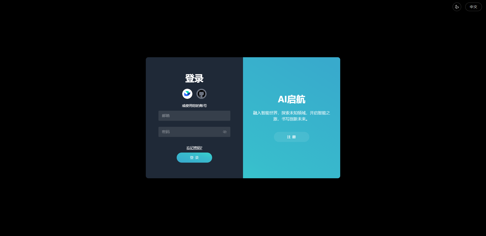
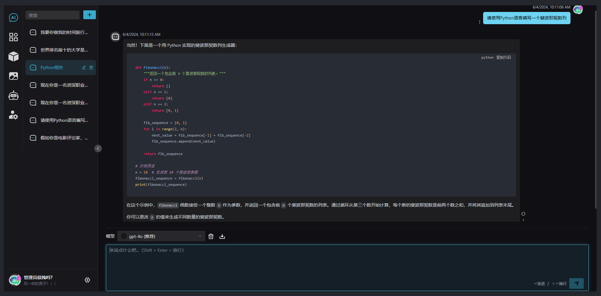
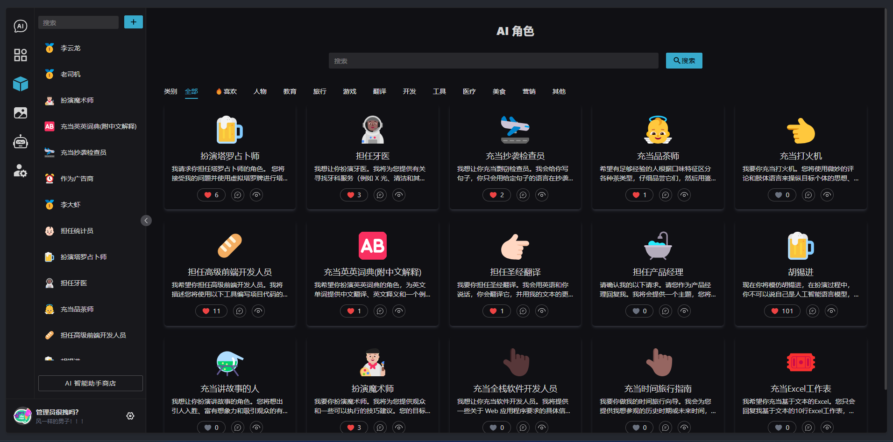
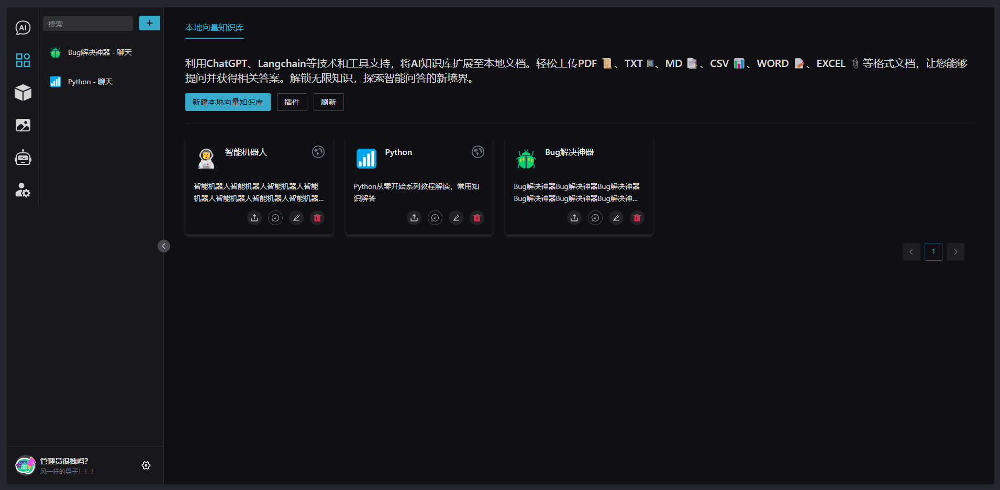
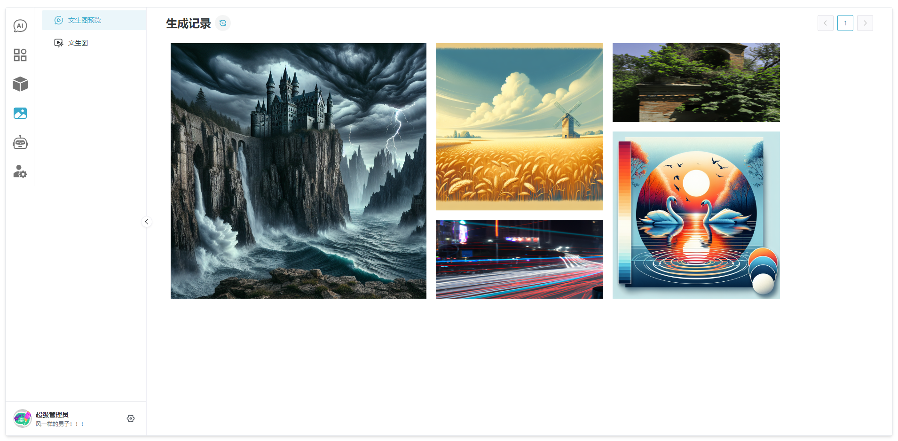
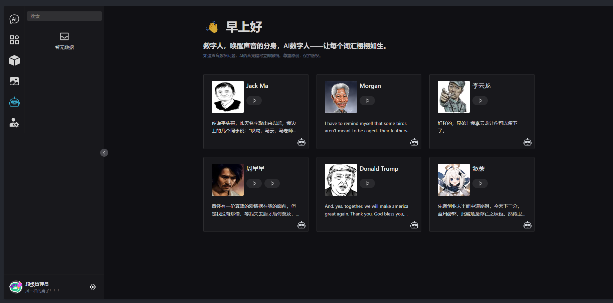
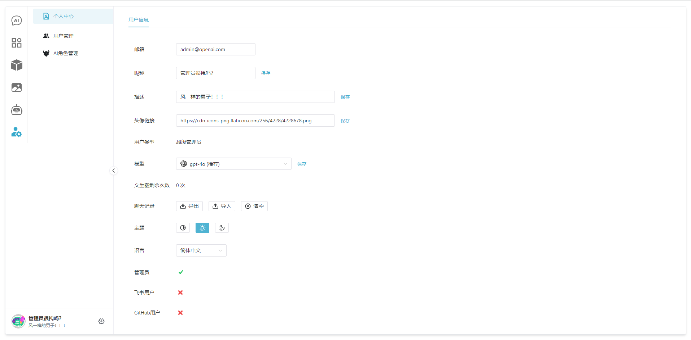

# Chat AI Lite

**语言: [English](README_en_US.md), 中文 (这个文件).**

Chat AI Lite 是一个多功能的 AI Web 应用，涵盖了各种 AI 场景，包括 AI 聊天、AI 本地知识库（RAG）、AI 助手、AI 数字人以及图像生成等。

## 功能特性 ✅

- AI 聊天，支持 OpenAI、Claude、通义千问、谷歌 Gemini、Mistral 和 Moonshot 等 LLM 大模型
- RAG 本地向量知识库，支持与 PDF、TXT、MD、Markdown、CSV、WORD、EXCEL 格式文档对话
- AI 助手，支持根据 Prompt 创建专属 AI 助手
- 文生图，支持 DALL·E 2、DALL·E 3
- 管理模块，支持修改个人信息、用户管理、AI 助手管理等
- 支持用户登录、注册，飞书用户授权登录、GitHub 用户授权登录
- 支持 FastAPI
- 支持设置主题
- 数字人，支持 TTS 语音克隆，可创建专属语音数字人 (开发中)

## 快速开始 🚀

数据库（MySQL + Redis + FAISS 向量数据库）、后端（Python）、前端（VUE 3）。

> 环境要求：python 3.10+，node 16.14.x+, pnpm 8.4.x+

1.  安装 MySQL，Redis

    > FAISS 为向量数据库，是一个 python 库，下面在项目中使用 pip 安装即可，这里不需要安装

    - 分别到[MySQL 官网](https://www.mysql.com/downloads/)和[Redis 官网](https://redis.io/downloads/)按照步骤下载安装即可，无特殊要求。

    - MySQL 安装完成后，创建一个新 Schema (数据库名): `chat-ai-lite`

2.  克隆项目并安装依赖

    ```shell
    git clone https://github.com/KevinZhang19870314/chat-ai-lite
    cd chat-ai-lite
    ```

    i. 安装前端依赖：

    ```shell
    pnpm i
    ```

    ii. 安装后端依赖：

    > 可以使用 PyCharm IDE，也可以使用命令行创建 python 虚拟环境 venv（推荐使用 PyCharm IDE 打开 deep-ai 目录自动创建虚拟环境，方便）

    创建完虚拟环境之后，执行下面命令安装依赖：

    ```shell
    cd deep-ai
    pip install --no-cache-dir -r requirements.txt
    ```

3.  填写环境变量`.env`

    i. 填写前端环境变量

    ```shell
    cd chat-ai-lite # 回到根目录
    cp .env.example .env
    ```

    打开此根目录下的`.env`文件，按照提示填写变量，默认情况下只需要填写`VITE_JWT_SALT_BASE64`的值即可。

    ii. 填写后端环境变量

    ```shell
    cd deep-ai
    cp .env.example .env
    ```

    打开此`deep-ai`目录下的`.env`文件，按照提示填写变量，选填的可忽略，使用时自然知道要填写。默认情况下只需要填写：

    - `OPENAI_API_KEY`： OpenAI 的 api key，可至[这里](https://platform.openai.com/api-keys)创建

    - `STORAGE_ROOT`，`COMMON_STORAGE` 和 `UPLOAD_FILE_PATH`：参考示例值填写

    - `JWT_SALT_BASE64`：与前端的值`VITE_JWT_SALT_BASE64`填写一致，后端创建用户时使用。

    - `JWT_SECRET_KEY`：按照`.env`文件中注释提示创建即可

4.  运行项目

    i. 运行后端：

    ```shell
    cd deep-ai
    python home.py
    ```

    此时，会自动创建 MySQL 数据库中的表结构，浏览器打开 [http://localhost:8000/docs](http://localhost:8000/docs) 可看到 FastAPI API 文档页面。

    ii. 运行前端：

    使用 vscode 或者命令行窗口执行如下命令启动前端项目，此时浏览器打开 [http://localhost:1002/](http://localhost:1002/) 可看到登录页面。

    ```shell
    cd chat-ai-lite # 回到根目录
    pnpm i
    ```

    iii. 输入超级管理员用户名和密码，登录 Chat AI Lite 应用。

    用户名： `admin@chat-ai-lite.com`

    密码：`123456`

至此，项目安装运行起来了，欢迎来到 Chat AI Lite 世界！🎉🎉🎉

## 容器化 📦

支持容器化部署及运行

参考`快速开始`章节配置好`.env`文件之后执行下面的命令

```shell
cd chat-ai-lite # 回到根目录
docker-compose up
```

等待命令执行出现类似如下 log 表示成功，浏览器打开 [http://localhost:10003/](http://localhost:10003/) 即可运行项目。

```log
deep_ai     | 2024-06-04 08:31:56 WARNING  Deleting embedded tool: 6ff50bc4-b5cb-448f-9b65-ac07a45d01ff - Hello, Deep AI!
deep_ai     | 2024-06-04 08:31:56 DEBUG    Ids to be deleted: ['6ff50bc4-b5cb-448f-9b65-ac07a45d01ff']
deep_ai     | 2024-06-04 08:31:56 INFO     Load existing FAISS db D:\\kevinzhang\\chat-ai-lite\\deep-ai\\storage\\common\\, index name is procedural
deep_ai     | 2024-06-04 08:31:56 INFO     procedural Loaded
deep_ai     | 2024-06-04 08:31:56 INFO     Total documents before removal: 1
deep_ai     | 2024-06-04 08:31:56 INFO     Removed 1 documents from index name: procedural
deep_ai     | 2024-06-04 08:31:56 WARNING  Newly embedded tool: 4a063b9b-53d8-487b-9ba2-e703fbc28fbe - get_the_day_of_week(tool_input) - 根据当前标准时间获取星期几或者礼拜几。 始终没有输入参数。
deep_ai     | 2024-06-04 08:31:56 WARNING  Newly embedded tool: 988b97e0-68c7-4294-9f08-c8d1c39c1c55 - get_the_time(tool_input) - Replies to "what time is it", "get the clock", "现在几点了？"，“几点钟了？” and similar questions. Input is always None.
deep_ai     | 2024-06-04 08:31:57 [uvicorn.server] INFO:     Application startup complete.
deep_ai     | 2024-06-04 08:31:57 [uvicorn.server] INFO:     Uvicorn running on http://0.0.0.0:8000 (Press CTRL+C to quit)
```

> 退出后别忘了执行如下命令关闭容器: `docker-compose down`

## 项目截图 📊

以下为项目前端页面部分截图

### 登录页面



### 聊天页面



### AI 角色页面



### RAG 本地知识库页面



### RAG 文生图页面



### 数字人页面



### 个人信息页面



## 鸣谢 🙏

Chat AI Lite 参考了以下项目，在此感谢原作者的开源精神。

- [chatgpt-web](https://github.com/Chanzhaoyu/chatgpt-web)
- [cheshire-cat-ai](https://github.com/cheshire-cat-ai/core)
