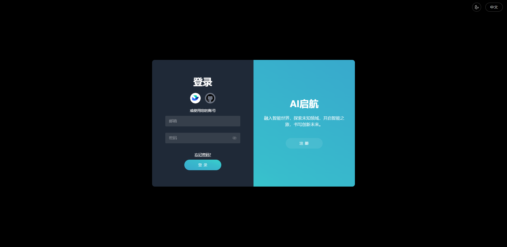
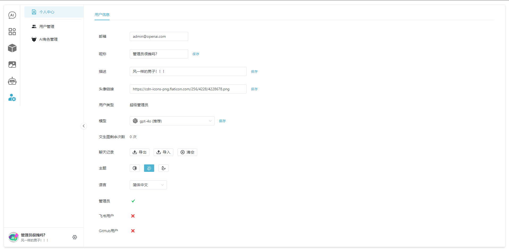

# Chat AI Lite

**Languages: English (this file), [中文](README.md).**

Chat AI Lite is a versatile AI web application that covers a wide range of AI scenarios, including AI chat, AI local knowledge base (RAG), AI assistant, AI digital human, and image generation.

## Features ✅

- AI Chat: Supports large language models such as OpenAI, Claude, Tongyi Qianwen, Google Gemini, Mistral, and Moonshot.
- RAG Local Vector Knowledge Base: Supports conversation with documents in PDF, TXT, MD, Markdown, CSV, WORD, and EXCEL formats.
- AI Assistant: Allows the creation of personalized AI assistants based on prompts.
- Text-to-Image: Supports DALL·E 2 and DALL·E 3.
- Management Module: Supports modification of personal information, user management, and AI assistant management.
- User Login and Registration: Supports user login, registration, Feishu user authorization login, and GitHub user authorization login.
- FastAPI Support
- Theme Settings
- Digital Human: Supports TTS voice cloning to create personalized voice digital humans (under development).

## Quick Start 🚀

Database (MySQL + Redis + FAISS vector database), backend (Python), frontend (VUE 3).

> Requirements: python 3.10+, node 16.14.x+, pnpm 8.4.x+

1.  Install MySQL and Redis

    > FAISS is a vector database and a Python library. It will be installed via pip in the project, no need to install it separately.

    - Download and install from the [MySQL official website](https://www.mysql.com/downloads/) and the [Redis official website](https://redis.io/downloads/).

    - After MySQL installation, create a new Schema (database name): `chat-ai-lite`.

2.  Clone the project and install dependencies

    ```shell
    git clone https://github.com/KevinZhang19870314/chat-ai-lite
    cd chat-ai-lite
    ```

    i. Install frontend dependencies:

    ```shell
    pnpm i
    ```

    ii. Install backend dependencies:

    > You can use PyCharm IDE or create a Python virtual environment venv via the command line (recommended to use PyCharm IDE to open the deep-ai directory to automatically create a virtual environment for convenience).

    After creating the virtual environment, run the following command to install dependencies:

    ```shell
    cd deep-ai
    pip install --no-cache-dir -r requirements.txt
    ```

3.  Fill in environment variables `.env`

    i. Fill in frontend environment variables

    ```shell
    cd chat-ai-lite # Return to the root directory
    cp .env.example .env
    ```

    Open the `.env` file in the root directory and fill in the variables as prompted. By default, you only need to fill in the value of `VITE_JWT_SALT_BASE64`.

    ii. Fill in backend environment variables

    ```shell
    cd deep-ai
    cp .env.example .env
    ```

    Open the `.env` file in the `deep-ai` directory and fill in the variables as prompted. Optional variables can be ignored for now and will become evident during use. By default, only the following need to be filled in:

    - `OPENAI_API_KEY`: OpenAI API key, can be created [here](https://platform.openai.com/api-keys).
    - `STORAGE_ROOT`, `COMMON_STORAGE`, and `UPLOAD_FILE_PATH`: Refer to the example values.
    - `JWT_SALT_BASE64`: Fill in the same value as the frontend's `VITE_JWT_SALT_BASE64`, used when creating users on the backend.
    - `JWT_SECRET_KEY`: Create as per the comments in the `.env` file.

4.  Run the project

    i. Run the backend:

    ```shell
    cd deep-ai
    python home.py
    ```

    At this point, the table structure in the MySQL database will be automatically created. You can view the FastAPI API documentation by opening [FastAPI API documentation page](http://localhost:8000/docs) in your browser.

    ii. Run the frontend:

    Use vscode or command line to run the following command to start the frontend project. The login page will be available at [http://localhost:1002/](http://localhost:1002/).

    ```shell
    cd chat-ai-lite # Return to the root directory
    pnpm i
    ```

    iii. Enter the super admin username and password to log in to the Chat AI Lite application.

    Username: `admin@chat-ai-lite.com`

    Password: `123456`

At this point, the project is up and running. Welcome to the world of Chat AI Lite! 🎉🎉🎉

## Containerization 📦

Supports containerized deployment and operation.

After configuring the `.env` file as described in the `Quick Start` section, execute the following command:

```shell
cd chat-ai-lite # Return to the root directory
docker-compose up
```

Wait for the command to execute and look for logs similar to the following, indicating success. The project will be available at [http://localhost:10003/](http://localhost:10003/).

```log
deep_ai     | 2024-06-04 08:31:56 WARNING  Deleting embedded tool: 6ff50bc4-b5cb-448f-9b65-ac07a45d01ff - Hello, Deep AI!
deep_ai     | 2024-06-04 08:31:56 DEBUG    Ids to be deleted: ['6ff50bc4-b5cb-448f-9b65-ac07a45d01ff']
deep_ai     | 2024-06-04 08:31:56 INFO     Load existing FAISS db D:\\kevinzhang\\chat-ai-lite\\deep-ai\\storage\\common\\, index name is procedural
deep_ai     | 2024-06-04 08:31:56 INFO     procedural Loaded
deep_ai     | 2024-06-04 08:31:56 INFO     Total documents before removal: 1
deep_ai     | 2024-06-04 08:31:56 INFO     Removed 1 documents from index name: procedural
deep_ai     | 2024-06-04 08:31:56 WARNING  Newly embedded tool: 4a063b9b-53d8-487b-9ba2-e703fbc28fbe - get_the_day_of_week(tool_input) - Gets the day of the week based on the current standard time. Always has no input parameters.
deep_ai     | 2024-06-04 08:31:56 WARNING  Newly embedded tool: 988b97e0-68c7-4294-9f08-c8d1c39c1c55 - get_the_time(tool_input) - Replies to "what time is it", "get the clock", "现在几点了？", “几点钟了？” and similar questions. Input is always None.
deep_ai     | 2024-06-04 08:31:57 [uvicorn.server] INFO:     Application startup complete.
deep_ai     | 2024-06-04 08:31:57 [uvicorn.server] INFO:     Uvicorn running on http://0.0.0.0:8000 (Press CTRL+C to quit)
```

> Don't forget to run the following command to shut down the container after exiting: `docker-compose down`.

## Project Screenshots 📊

Below are some screenshots of the project frontend pages:

### Login Page



### Chat Page


### AI Roles Page


### RAG Local Knowledge Base Page


### Text-to-Image Page


### Digital Human Page


### Personal Information Page



## Acknowledgements 🙏

Chat AI Lite was inspired by the following projects, and we extend our gratitude to the original authors for their open-source spirit.

- [chatgpt-web](https://github.com/Chanzhaoyu/chatgpt-web)
- [cheshire-cat-ai](https://github.com/cheshire-cat-ai/core)
